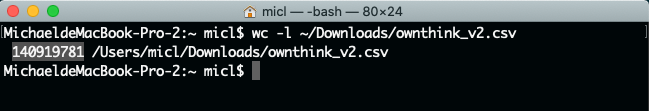
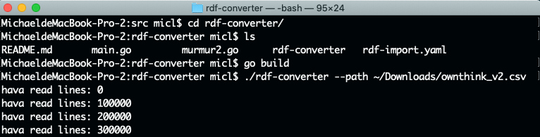
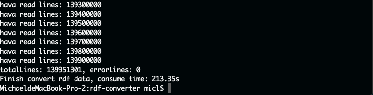

# Importing data into Nebula Graph database.

In this document, you will learn how to import a huge set of data for testing. The testing data is selected a huge data set of Chinese world. It located at [Ownlink repository on GitHub](https://github.com/ownthink/KnowledgeGraphData).

## How huge is the data set?

The ownthink.csv file is too huge to open. It cannot be view in Visual Studio Code even already set max memory size is 10GiB. The command wc can help counting line of the huge file.

wc command counts the number of lines, words, and bytes in the files specified by the File parameter. The command writes the number of newline characters, words, and bytes to the standard output and keeps a total count for all named files.

When you use the File parameter, the wc command displays the file names as well as the requested counts. If you do not specify a file name for the File parameter, the wc command uses standard input.



We got more than **140 million** lines of data in result.

## Convert data for importing

Someone already created a tool that can retrieve vetexs and edges from the ownthink huge CSV file. It written by golang. Before use this tool you need [setup go environment first](https://www.c-sharpcorner.com/article/go-for-golang-introduction-environment-setup/).


```shell
git clone https://github.com/jievince/rdf-converter.git
cd rdf-converter
go build
./rdf-converter --path ownthink_v2.csv
```

After source code build succeeded, you can use path parameter to specify the location of ownthink_v2.csv file. And then, the tool will auto generate vetex.csv and edge.csv that contain vetexs and edges of the whole graph. Besides that, the tool will auto ignore some data that not connected with graph. Then we got total 139 million data. 





## Change data storage path to make sure have enough space to store data

The default storage path is /usr/local/nebula/data/storage/. This path hosts on OS partition. The data needs a 20GiB disk space on disk. Please edit configuration file by nano.

```shell
sudo nano /usr/local/nebula/etc/nebula-storaged.conf
```
Change the --data_path value to a path with disk space that can storage data.
```shell
########## Disk ##########
# Root data path. Split by comma. e.g. --data_path=/disk1/path1/,/disk2/path2/
# One path per Rocksdb instance.
--data_path=/datadrive/storage
```


## Install Golang for importing tool

Before starting importation, you need setup a go environment on service. Because import tool is written by golang. The import tool requires go v1.13 and above.

```shell
cd ~
wget https://studygolang.com/dl/golang/go1.15.2.linux-amd64.tar.gz
mkdir go
cd go
tar -xvf go1.15.2.linux-amd64.tar.gz

```

And then add some environment in ~/.bashrc file.

```shell
sudo nano ~/.profile
```

```shell
export GOROOT=/usr/local/go
export GOPATH=$HOME/go
export GO111MODULE=on
export GOPROXY=https://goproxy.cn
export PATH=$PATH:$GOROOT/bin:$GOPATH/bin
```

Run below command to take effect.

```shell
source ~/.profile
```

## Deploy Nebula-Importer

nebula-importer is a tool for data importing. It can help user import both vertex and edge data into Nebula. It written by golang. You need build tool after you download source code.

```shell
sudo apt-get install make
git clone https://github.com/vesoft-inc/nebula-importer.git
cd nebula-importer
make build
```


## Importing data into Nebula database

It needs you put below files under same directory:

+ nebula-importer
+ vertex.csv
+ edge.csv
+ rdf-import.yaml


And then run below command:

```shell
./nebula-importer -config rdf-import.yaml
```

Then data will take a long time for importing.

```shell
2020/09/17 10:53:35 --- START OF NEBULA IMPORTER ---
2020/09/17 10:53:35 [WARN] config.go:208: Invalid retry option in clientSettings.retry, reset to 1 
2020/09/17 10:53:35 [WARN] config.go:159: You have not configured whether to remove generated temporary files, reset to default value. removeTempFiles: false
2020/09/17 10:53:35 [INFO] clientmgr.go:28: Create 40 Nebula Graph clients
2020/09/17 10:53:35 [INFO] reader.go:64: Start to read file(1): /home/micl/go/nebula-importer/edge.csv, schema: < :SRC_VID,:DST_VID,relation.name:string >
2020/09/17 10:53:35 [INFO] reader.go:64: Start to read file(0): /home/micl/go/nebula-importer/vertex.csv, schema: < :VID,entity.name:string >
2020/09/17 10:53:40 [INFO] statsmgr.go:61: Tick: Time(5.00s), Finished(605400), Failed(0), Latency AVG(26239us), Batches Req AVG(32416us), Rows AVG(121068.91/s)
2020/09/17 10:53:45 [INFO] statsmgr.go:61: Tick: Time(10.00s), Finished(1195000), Failed(0), Latency AVG(26882us), Batches Req AVG(33129us), Rows AVG(119482.77/s)
2020/09/17 10:53:50 [INFO] statsmgr.go:61: Tick: Time(15.00s), Finished(1842200), Failed(0), Latency AVG(26094us), Batches Req AVG(32335us), Rows AVG(122810.42/s)
2020/09/17 10:53:55 [INFO] statsmgr.go:61: Tick: Time(20.00s), Finished(2505400), Failed(0), Latency AVG(25492us), Batches Req AVG(31752us), Rows AVG(125262.47/s)
2020/09/17 10:54:00 [INFO] statsmgr.go:61: Tick: Time(25.00s), Finished(3112300), Failed(0), Latency AVG(25677us), Batches Req AVG(31999us), Rows AVG(124484.99/s)
......
2020/09/17 12:00:20 [INFO] reader.go:180: Total lines of file(/home/micl/go/nebula-importer/edge.csv) is: 139951301, error lines: 0
2020/09/17 12:00:20 [INFO] statsmgr.go:61: Tick: Time(4005.00s), Finished(213171933), Failed(0), Latency AVG(68631us), Batches Req AVG(74358us), Rows AVG(53226.45/s)
2020/09/17 12:00:22 [INFO] statsmgr.go:61: Done(/home/micl/go/nebula-importer/edge.csv): Time(4006.47s), Finished(213307919), Failed(0), Latency AVG(68599us), Batches Req AVG(74323us), Rows AVG(53240.84/s)
2020/09/17 12:00:22 Finish import data, consume time: 4006.97s
2020/09/17 12:00:23 --- END OF NEBULA IMPORTER ---
```

## References:

https://www.bookstack.cn/read/nebula-graph-1.0/824a5a8c9c5a833d.md

https://zhuanlan.zhihu.com/p/93613960
