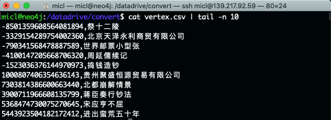
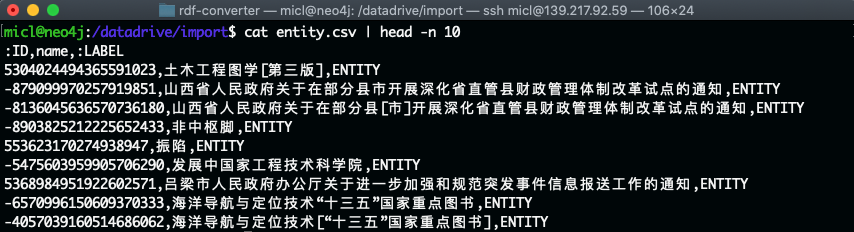
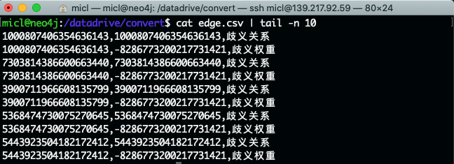
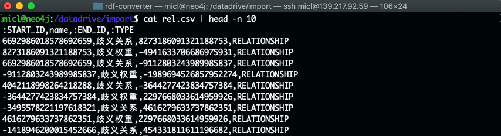
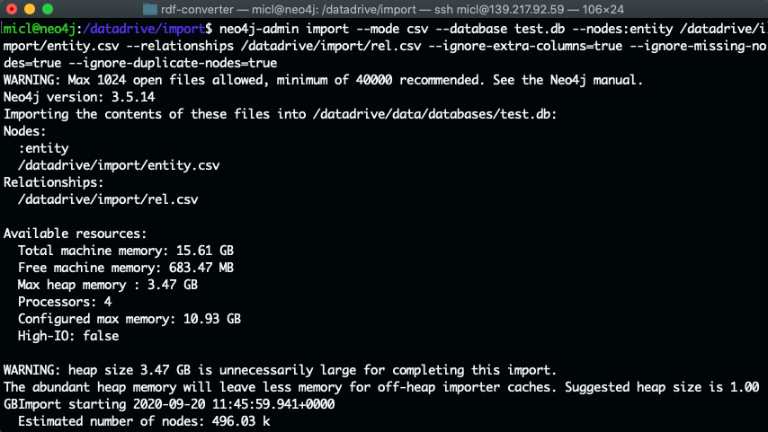
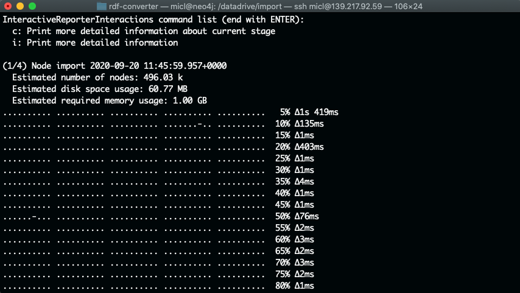
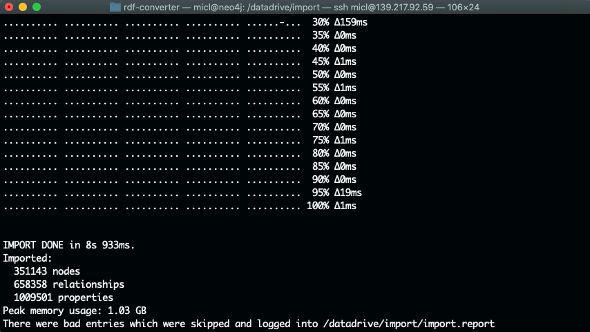

# Importing Data Into Neo4j Graph Database


## Specify data storage path

Since ownthink data is really huge, default storage space cannot afford all of data. It has to change data storage path to a path with disk space more than 20GiB. To achieve this, it needs edit configuration file which is located at: /etc/neo4j/neo4j.conf

```shell
sudo nano /etc/neo4j/neo4j.conf
```
In configuration file, you need to change values of dbms.directories.data and dbms.directories.logs. The /datadrive is an attached 1TB SSD disk.

```shell
#*****************************************************************
# Neo4j configuration
#
# For more details and a complete list of settings, please see
# https://neo4j.com/docs/operations-manual/current/reference/configuration-settings/
#*****************************************************************

# The name of the database to mount
#dbms.active_database=graph.db

# Paths of directories in the installation.
dbms.directories.data=/datadrive/data
dbms.directories.plugins=/var/lib/neo4j/plugins
dbms.directories.certificates=/var/lib/neo4j/certificates
dbms.directories.logs=/datadrive/logs
dbms.directories.lib=/usr/share/neo4j/lib
dbms.directories.run=/var/run/neo4j
```

And then, restart neo4j service to effect configure changes. 

To know how to attach disk to a Linux VM on Azure, please view:
https://docs.microsoft.com/zh-cn/azure/virtual-machines/linux/attach-disk-portal


## Converting data

The neo4j needs a different format for data importing.  Neo4j needs seperatedly import vertex and edges from comma seperated value file. To retrieve vertex and exdeges from ownthink_v2.csv, you need use a tool for Nebula Graph: nebula-importer. Please review the document: [Immport data into Nebula](./Import-Data-Nebula.md).

After you've gottern vertex.csv and edge.csv file, you are ready for prepare data importing into Neo4j.

The data in vertex.csv is looks like this:



In this file, there are two columns. The first one is a long integer which is the ID of the vertex. The second column is the name of vertex.

The importing format of vertex regarding neo4j as below:

 
 The csv file requires column header ":ID,name,:LABEL". ID is the unique identifier of vertex, LABEL is the typeof vertex.

 To build this entity.csv file, you need a code snippt of python as below:

 ```python
from __future__ import print_function
import pandas as pd
import os.path

import time

# Please uncomment below 3 lines if default python environment is ASCII.
# import sys
# reload(sys)
# sys.setdefaultencoding('utf8')


#start time.
start = time.time()

# constraints
ENTITY_LABEL = 'ENTITY'
TYPE = 'RELATIONSHIP'

inputFilename = 'vertex.csv'
outputFilename = 'entity.csv'

# neo4j schema of entity
entity_map = {":ID": [], "name": [], ':LABEL': []}

# delete output file if already exists.
if(os.path.exists(outputFilename)):
    os.remove(outputFilename)

# reading file.
file = pd.read_csv(inputFilename, iterator=True, chunksize=1000000, encoding="utf_8")

i = 1;

pd.DataFrame(entity_map, columns=[":ID", "name", ':LABEL'])\
    .to_csv(outputFilename, encoding="utf_8_sig", index=False, header=True)

# handle data line by line.
for chunk in file:    
    for _, row in chunk.iterrows():
        entity_map[':ID'].append(row[0])
        entity_map['name'].append(str(row[1]))
        entity_map[':LABEL'].append(ENTITY_LABEL)
        print("Now handling:{}".format(i), end='\r')
        i = i + 1

    pd.DataFrame(entity_map, columns=[":ID", "name", ':LABEL'])\
        .to_csv(outputFilename, encoding="utf_8_sig", index=False, header=True)
    print("Now Writing:{}".format(i))
    entity_map = {":ID": [], "name": [], ':LABEL': []}

print('Total time:{}'.format(time.time() - start))
f = open("entity_completed.txt", "a")
f.write("Total records: {}".format(i))
f.close()
 ```
Please save this code snippet into a file of convert-vertex-neo4j.py. And then run it under the folder contains vertex.csv file.

To read and build all of vertex data, it will take more than 3 hours with below results:

Total vertex:733566187
Total time:11655.5607669 seconds

The edge in neo4j called relationship. To orignal edge.csv looks like this:



There are three columns in the file. First column refers start vertex ID. Second column refers end vertex. Third column is the name of the edge.

The relationship format of neo4j requires is below:



The file requires columns header in first line. START_ID refers start ID of vertex. END_ID refers end ID of vertex in a relationship.

To build rel.csv for importing data in to neo4j, please use below python snippet:

```python
from __future__ import print_function
import pandas as pd
import os.path

import time

# Please un-comment below 3 lines if python not support UTF-8 by default.
# import sys
# reload(sys)
# sys.setdefaultencoding('utf8')

# starting time.
start = time.time()

# constraints
ENTITY_LABEL = 'ENTITY'
TYPE = 'RELATIONSHIP'

inputFilename = 'edge.csv'
outputFilename = 'rel.csv'

# neo4j schema of entity
rel_map = {":START_ID": [], "name": [], ':END_ID': [], ":TYPE": []}

# delete output file if already exists.
if(os.path.exists(outputFilename)):
    os.remove(outputFilename)

# reading file.
file = pd.read_csv(inputFilename, iterator=True, chunksize=1000000, encoding="utf_8")

i = 1;

pd.DataFrame(rel_map, columns=[":START_ID", "name", ':END_ID', ":TYPE"]) \
    .to_csv(outputFilename, encoding="utf_8_sig", index=False, header=True)

# handle data line by line.
for chunk in file:    
    for _, row in chunk.iterrows():
        rel_map[':START_ID'].append(row[0])
        rel_map['name'].append(str(row[2]))
        rel_map[':END_ID'].append(row[1])
        rel_map[':TYPE'].append(TYPE)

        print("Now handling: {}".format(i), end='\r')
        i = i + 1

    pd.DataFrame(rel_map, columns=[":START_ID", "name", ':END_ID', ":TYPE"]) \
        .to_csv(outputFilename, encoding="utf_8_sig", index=False, header=True)
    print("Now Writing:{}".format(i))
    rel_map = {":START_ID": [], "name": [], ':END_ID': [], ":TYPE": []}

print('Total time: {}'.format(time.time() - start))
f = open("rel_completed.txt", "a")
f.write("Total records: {}".format(i))
f.close()
```
Build relationship much longer than build entities. It almost takes 7 hours. The result as below:

Relationship:13995130100
Total time: 24144.1419001 seconds.


## Importing data

To importing huge set of data, you need stop neo4j service first. And then use neo4j-admin command with import sub command.

| Parameters | Notes|
|:-|:-|
|--database=<name>|Name of database. [default:graph.db]|
|--additional-config=<config-file-path>|Configuration file to supply additional configuration in. [default:]|
|--mode=<database|csv>|Import a collection of CSV files or a pre-3.0 installation. [default:csv]|
|--from=<source-directory>|The location of the pre-3.0 database (e.g. <neo4j-root>/data/graph.db).|
|--report-file=<filename>|File in which to store the report of the csv-import.[default:import.report]|
|--nodes[:Label1:Label2]=<"file1,file2,...">|Node CSV header and data. Multiple files will be logically seen as one big file from the perspective of the importer. The first line must contain the header. Multiple data sources like these can be specified in one import, where each data source has its own header. Note that file groups must be enclosed in quotation marks. [default:]|
|--relationships[:RELATIONSHIP_TYPE]=<"file1,file2,...">|Relationship CSV header and data. Multiple files will be logically seen as one big file from the perspective of the importer. The first line must contain the header. Multiple data sources like these can be specified in one import, where each data source has its own header. Note that file groups must be enclosed in quotation marks. [default:]|
|--id-type=<STRING|INTEGER|ACTUAL>|Each node must provide a unique id. This is used to find the correct nodes when creating relationships. Possible values are:STRING: arbitrary strings for identifying nodes,INTEGER: arbitrary integer values for identifying nodes,ACTUAL: (advanced) actual node ids.For more information on id handling, please see the Neo4j Manual:https://neo4j.com/docs/operations-manual/current/tools/import/[default:STRING]|
|--input-encoding=<character-set>|Character set that input data is encoded in. [default:UTF-8]|
|--ignore-extra-columns=<true|false>|If un-specified columns should be ignored during the import.[default:false]|
|--ignore-duplicate-nodes=<true|false>|If duplicate nodes should be ignored during the import. [default:false]
|--ignore-missing-nodes=<true|false>|If relationships referring to missing nodes should be ignored during the import. [default:false]|
|--multiline-fields=<true|false>|Whether or not fields from input source can span multiple lines, i.e.contain newline characters. [default:false]|
|--delimiter=<delimiter-character>|Delimiter character between values in CSV data. [default:,]|
|--array-delimiter=<array-delimiter-character>|Delimiter character between array elements within a value in CSV data.[default:;]|
|--quote=<quotation-character>|Character to treat as quotation character for values in CSV data. Quotes can be escaped as per RFC 4180 by doubling them, for example "" would be interpreted as a literal ". You cannot escape using \. [default:"]|
|--max-memory=<max-memory-that-importer-can-use>|Maximum memory that neo4j-admin can use for various data structures and caching to improve performance. Values can be plain numbers, like 10000000 or e.g. 20G for 20 gigabyte, or even e.g. 70%. [default:90%]|
|--f=<File> | containing all arguments to this import> File containing all arguments, used as an alternative to supplying all arguments on the command line directly.Each argument can be on a separate line or multiple arguments per line separated by space.Arguments containing spaces needs to be quoted.Supplying other arguments in addition to this file argument is not supported. [default:]|
|--high-io=<true/false>|Ignore environment-based heuristics, and assume that the target storage subsystem can support parallel IO with high throughput. [default:null]|

To import data into test.db and ignore most of errors in data, please use below commands:

```shell
sudo neo4j stop

neo4j-admin import --mode csv --database test.db --nodes:entity /datadrive/import/entity.csv --relationships /datadrive/import/rel.csv --ignore-extra-columns=true --ignore-missing-nodes=true --ignore-duplicate-nodes=true

sudo neo4j start
```




The whole importing action is really fast that less than 1 second.

